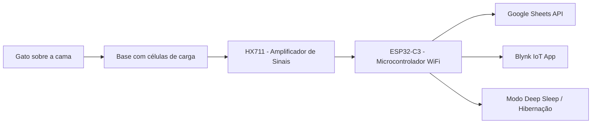

<p align="center">
  <span style="font-size:18px; color:blue; font-style:italic;">
    <b>Monitoramento automático de peso e comportamento de felinos com ESP32-C3, HX711 e integração com Google Sheets e Blynk.</b>
  </span>
</p>

---

<p align="center">
  <a href="https://github.com/arnaldomacari/CamaGatoIoT/stargazers"></a>
  <a href="https://github.com/arnaldomacari/CamaGatoIoT/issues"></a>
  <a href="https://github.com/arnaldomacari/CamaGatoIoT"></a>
  
  
  <a href="LICENSE"></a>
</p>

---

## 📘 Resumo

O projeto **Cama de Gato com Balança IoT** propõe o monitoramento automatizado do peso de felinos domésticos, permitindo detectar variações corporais associadas a condições fisiológicas ou patológicas. O sistema usa uma base com **células de carga e módulo HX711**, controlados por um **ESP32-C3** que opera em deep sleep para economizar energia e desperta periodicamente para coletar e enviar dados.

As medições são transmitidas automaticamente para:
- uma **planilha no Google Sheets**, que mantém o histórico e facilita análises;
- o **aplicativo Blynk**, onde o tutor acompanha leituras em tempo real e dispara medições manuais.

---

## 🧠 Objetivos

- Detectar variações sutis de peso corporal em gatos, indicando possíveis doenças metabólicas ou alterações alimentares.
- Desenvolver um sistema de monitoramento contínuo, não invasivo, de baixo custo e com conectividade em nuvem.
- Contribuir para estudos e práticas de bem-estar animal e telemetria veterinária.

---

## ⚙️ Arquitetura do Sistema



---

## 🧩 Componentes Utilizados

| Componente                   | Função                         | Observações                              |
| ---------------------------- | ------------------------------ | ---------------------------------------- |
| **ESP32-C3**                 | Microcontrolador principal     | Comunicação Wi-Fi e deep sleep           |
| **HX711**                    | Conversor ADC 24 bits          | Leitura das células de carga             |
| **Células de carga**         | Sensor de peso                 | Montadas em ponte de Wheatstone          |
| **Sensor capacitivo**        | Interação do usuário           | Acorda o sistema do modo de hibernação   |
| **Divisor resistivo (R1=R2)**| Monitoramento da bateria       | Lido pelo ADC do ESP32-C3                |
| **Fonte/Bateria 5V ou LiPo** | Alimentação                    | Requer estabilidade para leituras precisas |
| **Google Apps Script**       | Integração com planilha        | Recebe POST JSON do ESP32-C3             |
| **Blynk App (Free Tier)**    | Interface do usuário           | Widgets V0, V1, V4, V8 e V9 configurados |

> Opcional: incluir um sensor DS18B20 para temperatura ambiente (suporte futuro no firmware).

---

## 🔌 Circuitos

Adicione seus esquemas elétricos ou diagrama de ligação neste diretório para facilitar a reprodução do hardware:

- `images/circuito_principal.png` – visão geral da conexão entre ESP32-C3, HX711, células de carga e alimentação.
- `images/circuito_touch.png` – ligação do sensor capacitivo no GPIO 2 e referência ao modo deep sleep.
- `images/circuito_divisor_bateria.png` – divisor resistivo para monitoramento da tensão da bateria.

```text
images/
├── circuito_principal.png
├── circuito_touch.png
└── circuito_divisor_bateria.png
```

> Se preferir, exporte também versões em PDF/SVG a partir do seu software de CAD/Fritzing.

---

## 🔄 Funcionamento

- A cada ~10 minutos o ESP32-C3 acorda do deep sleep.
- Verifica se há peso ≥ 300 g acima da tara; caso contrário volta a dormir.
- Se detectar massa relevante, compara com a última leitura enviada:
  - se passaram ≥ 24 h ou houve variação ≥ 100 g, registra o novo valor;
  - envia peso e nível de bateria para o Google Sheets e para o Blynk.
- O usuário pode acordar o sistema com o botão capacitivo para:
  - solicitar uma nova pesagem manual (widget `V0`);
  - tarar a balança (widget `V1`).
- Sem interação manual, o dispositivo volta a dormir após ~5 minutos acordado.

---

## 🛠️ Requisitos de Software

- Arduino IDE ≥ 2.0 ou PlatformIO com suporte a ESP32-C3.
- Bibliotecas:
  - [ESP32 Arduino Core](https://github.com/espressif/arduino-esp32) (inclui `WiFi`, `Preferences`, `esp_sleep`).
  - [HX711](https://github.com/bogde/HX711).
  - [Blynk](https://github.com/blynkkk/blynk-library) (com `BlynkMultiClient`).
- Conta Google com acesso ao Apps Script e Google Sheets.
- Conta Blynk (Free Tier compatível).

---

## 🚀 Como Começar

1. **Clonar o repositório**
   ```bash
   git clone https://github.com/arnaldomacari/CamaGatoIoT.git
   cd CamaGatoIoT
   ```

2. **Criar `senhas.h`** (não versionado) na raiz do projeto:
   ```cpp
   #define yourSSID "NOME_DA_REDE"
   #define yourPASS "SENHA_DA_REDE"
   #define yourScriptURL "https://script.google.com/macros/s/SEU_APP/exec"

   #define YOUR_BLYNK_TEMPLATE_ID "TMPLxxxx"
   #define YOUR_BLYNK_TEMPLATE_NAME "Nome do Template"
   #define YOUR_BLYNK_AUTH_TOKEN "token_do_dispositivo"
   ```

3. **Configurar o Blynk**
   - Crie um template com widgets:
     - `V0` botão momentâneo (Pesagem manual).
     - `V1` botão momentâneo (Tara).
     - `V4` display numérico (Tensão da bateria).
     - `V8` display numérico (Peso atual em kg).
     - `V9` gráfico ou histórico (Últimos envios em kg).
   - Copie `Template ID`, `Template Name` e `Auth Token` para `senhas.h`.

4. **Publicar o Google Apps Script**
   - Crie uma planilha e um Apps Script para receber POST com JSON (`peso`, `temperatura`, `bateria`).
   - Publique como aplicação web acessível a qualquer pessoa com o link.
   - Cole a URL gerada em `yourScriptURL`.

5. **Selecionar a placa e compilar**
   - Na IDE, escolha a placa `ESP32C3 Dev Module` (ou sua variante).
   - Ajuste a porta serial e compile.
   - Faça upload e monitore a serial a 115200 bps (ativando `#define debug` para logs detalhados).

---

## ⚖️ Calibração e Operação

- Ajuste `scalaPref_` e `offsetPref_` com o peso de referência antes do primeiro uso; valores são persistidos em `Preferences`.
- Use `V1` (Tara) sempre que reposicionar a cama.
- Para leituras consistentes:
  - garanta alimentação estável e neutro mecânico das células de carga;
  - afaste interferências eletromagnéticas (cabos longos, motores, etc.).
- O LED onboard sinaliza estados de conexão (piscadas controladas pelo firmware).

---

## 💾 Estrutura do Repositório

- `CamaGatoIoT.ino` – firmware principal com máquina de estados, leituras e integrações.
- `senhas.h` – credenciais locais (exemplo acima, mantenha fora do versionamento).
- `images/` – diagramas e fotos do protótipo (adicione `banner_cama_gato_iot.png` e demais imagens).
- `LICENSE` – licença MIT.

---

## 🖼️ Imagens do Protótipo

| Protótipo físico | Diagrama elétrico |
| ---------------- | ----------------- |
| _adicione uma foto em_ `images/prototipo.jpg` | _adicione o diagrama em_ `images/diagrama_circuito.png` |

---

## 📊 Exemplo de Planilha Google

- Campos sugeridos: `timestamp`, `peso_kg`, `variacao_kg`, `bateria_v`, `origem` (timer ou manual).
- Inclua gráficos de tendência e alertas automáticos para quedas/acréscimos acentuados.

---

## 🧪 Testes e Métricas Atuais

- Precisão média de ±5 g após calibração com pesos padrão.
- Consumo em deep sleep < 20 µA.
- Envio estável para Google Sheets (Apps Script) e atualização do painel Blynk.
- Próximos testes: medir autonomia com bateria LiPo e validar leitura de temperatura (DS18B20).

---

## 📚 Referências

- Penell et al. (2019). *Body weight changes as early indicators of feline health problems*. JAVMA, 255(2), 205–214.
- Instituto Pet Brasil (2024). *Censo de gatos no Brasil: 30,8 milhões de gatos domésticos*.
- Espressif Systems (2023). *ESP32-C3 Datasheet*.
- Avia Semiconductor. *HX711 Load Cell Amplifier Datasheet*.

---

## 👨‍🔬 Autor

**Arnaldo José Macari**  
Engenheiro de Alimentos e Desenvolvedor de Sistemas Embarcados  
São José do Rio Preto – SP, Brasil

---

## 🪪 Licença

Distribuído sob a licença MIT. Consulte o arquivo [`LICENSE`](LICENSE) para mais informações.

---

## 🤝 Contribuição

Contribuições são bem-vindas! Abra uma issue ou envie um pull request com melhorias no firmware, documentação ou design mecânico.

<p align="center">
  <sub>Desenvolvido com ❤️ e curiosidade científica – integrando IoT, automação e bem-estar animal.</sub>
</p>
